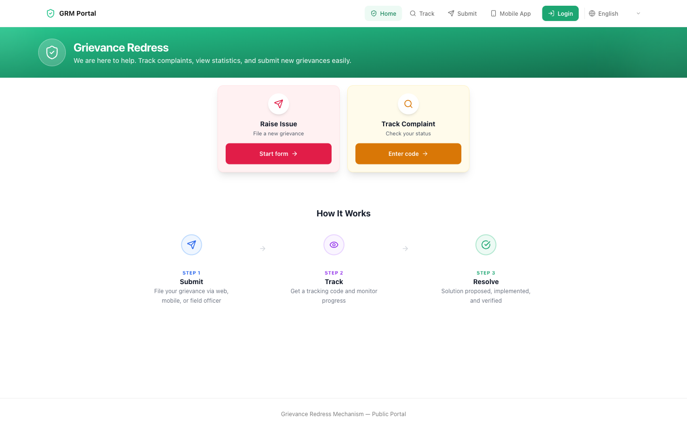
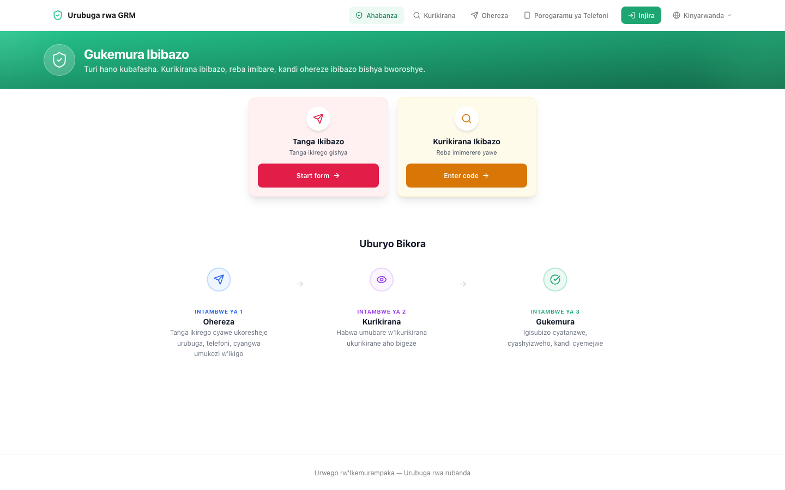

You do **not** need an account, a password, or a smartphone app to report a
problem. Everything on this page works from any web browser.

Open **[egrm.risa.gov.rw/grm-portal](https://egrm.risa.gov.rw/grm-portal)**.

## The two things you can do

| I want to… | Where to click |
| --- | --- |
| Report a new problem | **Submit a Complaint → Start form** |
| Check a problem I already reported | **Track a Complaint → Enter code** |

Both buttons are on the home page, and both are also in the menu along the
top of every page.

## Change the language

The website opens in Kinyarwanda. To read it in another language, use the
selector at the **top-right** of any page. Three choices are available:

- **Kinyarwanda** (the default)
- **English**
- **Français**

Your choice applies immediately and stays as you move between pages.

<Callout type="info">
Changing the language changes the labels and buttons. It does not change
anything about your complaint, and you can switch back at any time.
</Callout>

## What "Mobile App" in the menu is for

The **Mobile App** link is for field officers who collect complaints in places
with no internet. As a member of the public you do not need it — the website
does everything you need.

## Next

<Cards>
  <Card
    title="Send a complaint"
    description="A four-step form. Takes a few minutes."
    href="/docs/citizen/submit"
  />
  <Card
    title="Check a complaint"
    description="Use your tracking code to see the current status."
    href="/docs/citizen/track"
  />
</Cards>
