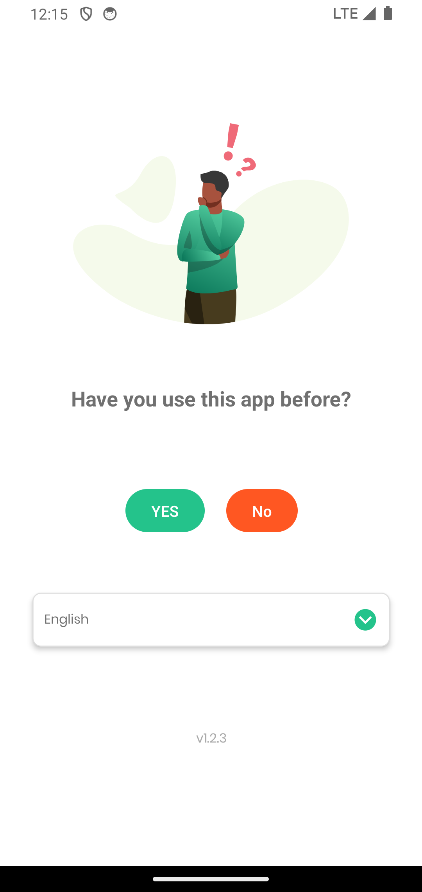
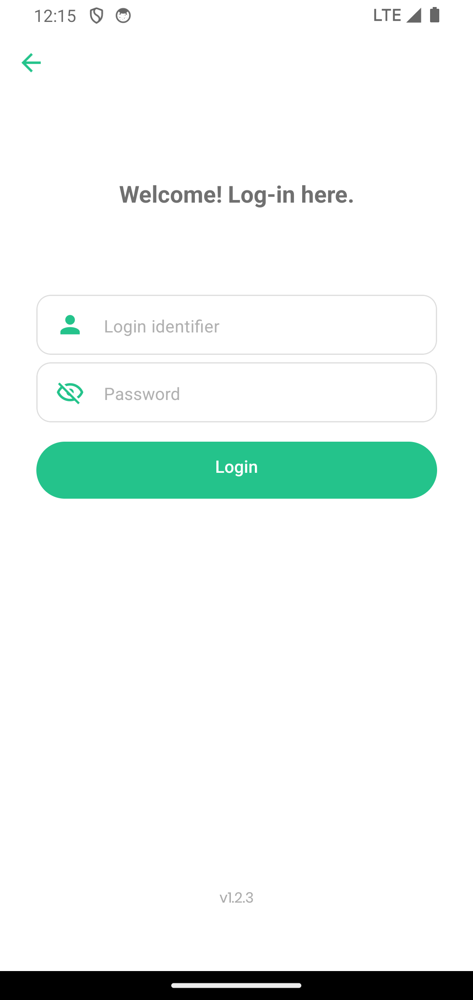
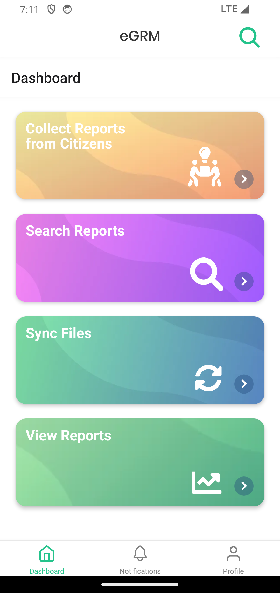
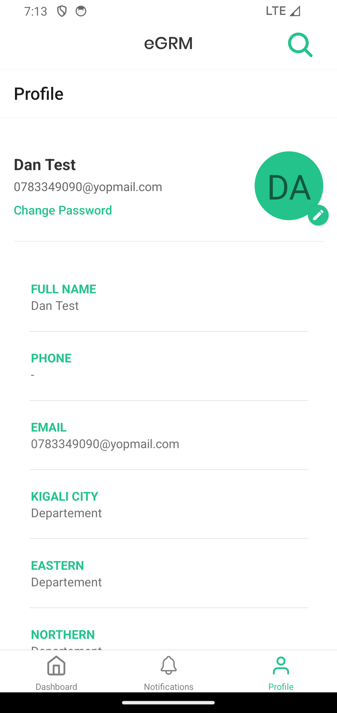

Field officers do most of their work away from a desk — at a community
meeting, at a site visit, in a village with no reliable signal. The eGRM
mobile app is the same system as the website, sized for a phone, and it keeps
working when the network does not.

<Callout type="info">
The app is for **staff**, not for the public. Members of the public report
problems on the website at
**[egrm.risa.gov.rw/grm-portal](https://egrm.risa.gov.rw/grm-portal)** — see
[For the public](/docs/citizen). You need a staff account to get past the
sign-in screen.
</Callout>

## What you can do with it

- **Record a complaint** a citizen brings to you, through a six-step
  conversation designed to be read aloud.
- **See the complaints assigned to you**, and what stage each one is at.
- **See the figures** for your area — how many complaints, how many resolved,
  how long they take.

Assigning and resolving are possible from the app too, but they are easier on
the website. This guide covers recording and viewing.

## Open the app

The first screen asks whether you have used the app before, and lets you pick
your language.

<Phone>

</Phone>

Choose **YES** if you already have an account — which you do, if an
administrator created one for you. Your language choice here applies to the
whole app, and you can change it later from **Profile**.

## Sign in

<Phone>

</Phone>

Enter the same **email address and password** you use on the website. If you
have never signed in anywhere, ask your administrator for them.

<Callout type="warn">
The app needs a working internet connection **the first time you sign in**,
and again whenever you want to send in what you have collected. It does not
need one in between — see [Working without signal](/docs/mobile/reports#working-without-signal).
</Callout>

## The home screen

<Phone>

</Phone>

Four cards, in the order you will normally use them:

| Card | What it does |
| --- | --- |
| **Collect Reports from Citizens** | Record a new complaint — [step by step](/docs/mobile/record) |
| **Search Reports** | The complaints assigned to you, grouped by stage |
| **Sync Files** | Send what you have collected and pull down anything new |
| **View Reports** | Totals and trends for your area |

At the bottom are three tabs — **Dashboard**, **Notifications** and
**Profile**. Profile shows your name, your email, the regions you cover, and
a **Change Password** link.

<Phone>

</Phone>
