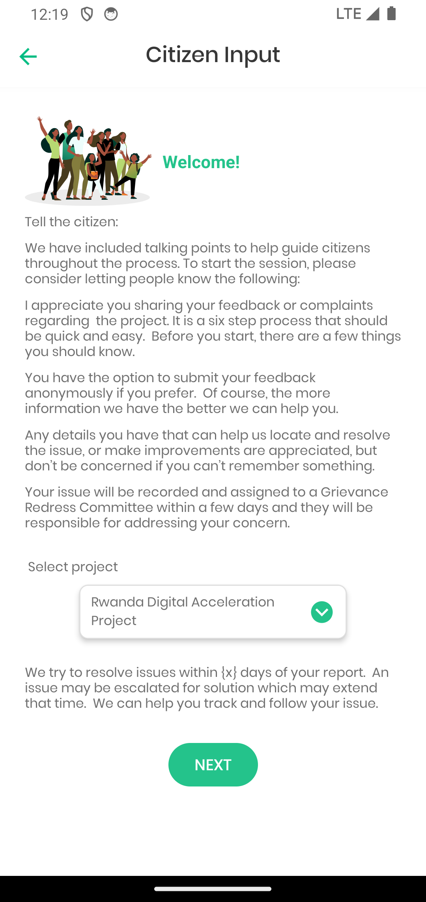
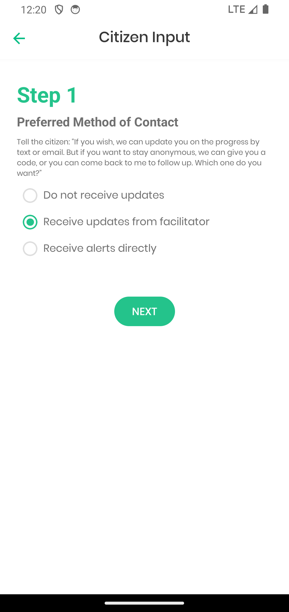
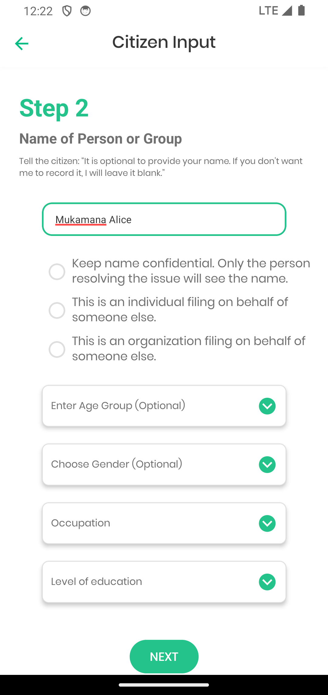
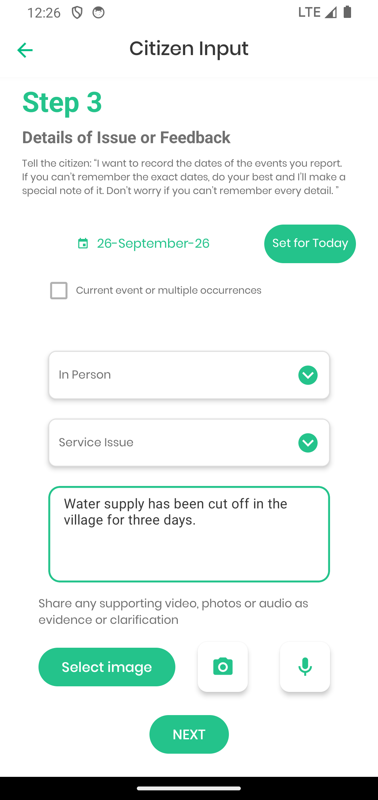
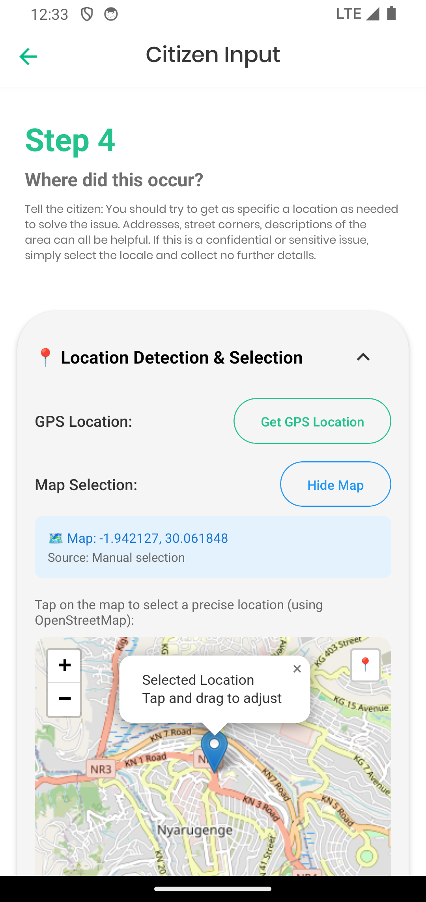
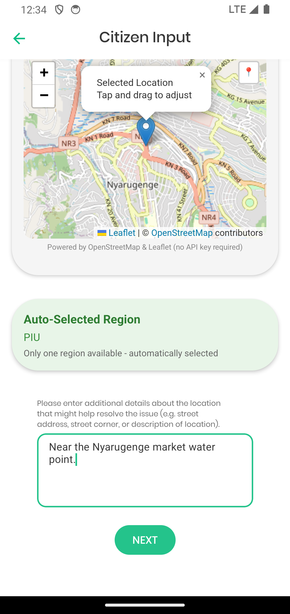
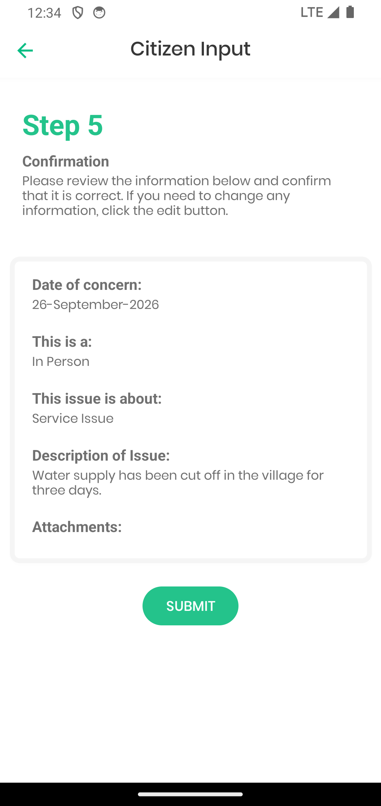
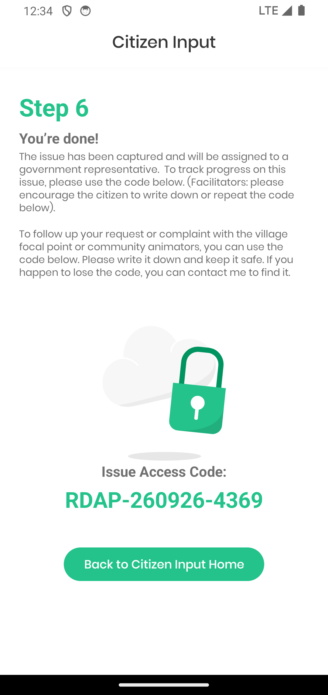

Tap **Collect Reports from Citizens** on the home screen. What follows is a
six-step conversation. Each step shows you, in grey, the words to say to the
person in front of you — you can read them aloud as they are written.

<Callout type="info">
Nothing is sent anywhere until you finish **Step 5**. You can work through
all six steps with no signal at all; the complaint is stored on the phone and
goes up the next time you are connected.
</Callout>

## Before you start: pick the project

<Phone>

</Phone>

Choose the project the complaint belongs to. If you only work on one project
it is already selected. Then tap **NEXT**.

<Steps>

<Step>
### How should we contact them?

<Phone>

</Phone>

Three choices:

| Choice | Use it when |
| --- | --- |
| **Do not receive updates** | They want nothing sent to them at all |
| **Receive updates from facilitator** | They will come back to you for news — the safest default |
| **Receive alerts directly** | They want an SMS or email, and will give you the number or address |

If you are unsure, leave it on **Receive updates from facilitator** and make
sure they leave with their tracking code.
</Step>

<Step>
### Who is reporting?

<Phone>

</Phone>

The name is **optional**. Say so out loud — the screen tells you to. If they
would rather not be named, leave it blank and move on; the complaint is
recorded exactly the same way.

Three tick-boxes below it matter:

- **Keep name confidential** — the name is stored but only the officer
  resolving the complaint can see it.
- **Filing on behalf of someone else** — an individual, or an organisation.

Age group, gender, occupation and education are all optional. They are used
for reporting on who the mechanism actually reaches, so fill them in if the
person is comfortable answering — and skip them if not.
</Step>

<Step>
### What happened?

<Phone>

</Phone>

This is the step that decides whether the complaint can be resolved.

- **The date** — when the problem happened, not today. Tap **Set for Today**
  only if it is happening now. Tick **Current event or multiple occurrences**
  for something ongoing.
- **How it reached you** — In Person, Phone Call, SMS, Email, Verbal or
  Written. Choose the channel the person actually used, not the device you
  are typing on.
- **What kind of issue** — Complaint, Service Issue, Question or Other.
- **The description** — in the person's own words, as fully as you can. A
  reviewer who was not there has only this to work from.

You can attach a **photo**, pick an existing **image**, or record **audio**
using the three buttons below the description. Attachments upload when the
phone next has signal.
</Step>

<Step>
### Where did it happen?

<Phone>

</Phone>

Two ways to set the place:

- **Get GPS Location** — use this when you are standing at the spot.
- **Tap on the map** — use this when the person is describing somewhere else.
  Tap, and drag the pin to adjust.

Either way the app shows the coordinates it captured and where they came
from.

Scroll down and the app names the **region** the complaint will be filed
under. If you only cover one region it is chosen for you and says so.

<Phone>

</Phone>

Underneath, add anything that helps someone find the place — a street corner,
a facility name, a landmark. A district name on its own is rarely enough.

<Callout type="warn">
The region decides **who receives the complaint**. If the place the person
describes is not in a region you cover, record it anyway, name the exact
place in the description, and tell your administrator afterwards.
</Callout>
</Step>

<Step>
### Read it back

<Phone>

</Phone>

The app shows everything you entered on one screen. Read the description back
to the person and check the date. Anything wrong — go back with the arrow at
the top-left and fix it.

Then tap **SUBMIT**.
</Step>

<Step>
### Give them the code

<Phone>

</Phone>

The app produces a tracking code like `RDAP-260926-4369`.

<Callout type="warn">
Read the code back to the person and make sure they have written it down
before they leave. If they chose not to give contact details, this code is
the only way they will ever be able to check their complaint again.
</Callout>

Tell them they can check it at **egrm.risa.gov.rw/grm-portal** under
**Track**, or by coming back to you with the code.

Tap **Back to Citizen Input Home** to record the next one.
</Step>

</Steps>

## Ask before you save

The quality of a complaint is decided entirely in this conversation. Before
Step 5, check you have:

- **Where exactly** — a village, facility or landmark, not just a district.
- **When exactly** — a date, even an approximate one.
- **What specifically went wrong**, in their words rather than a summary like
  "service problem".
- **Whether they want to be contacted**, and a number if they do.
