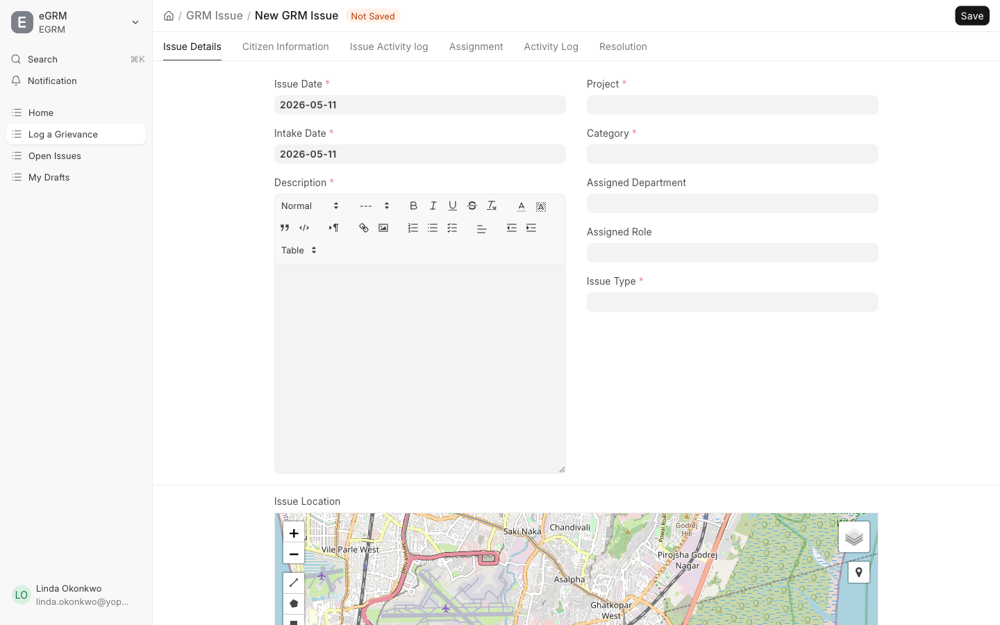
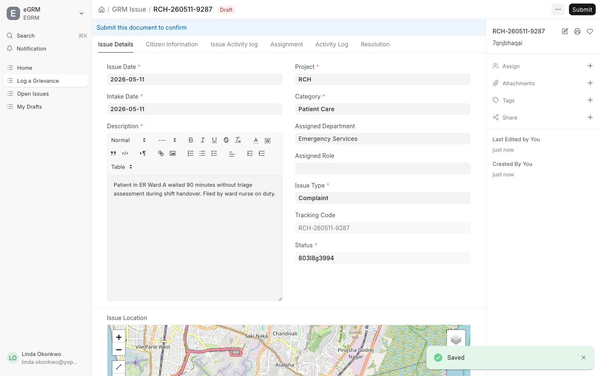
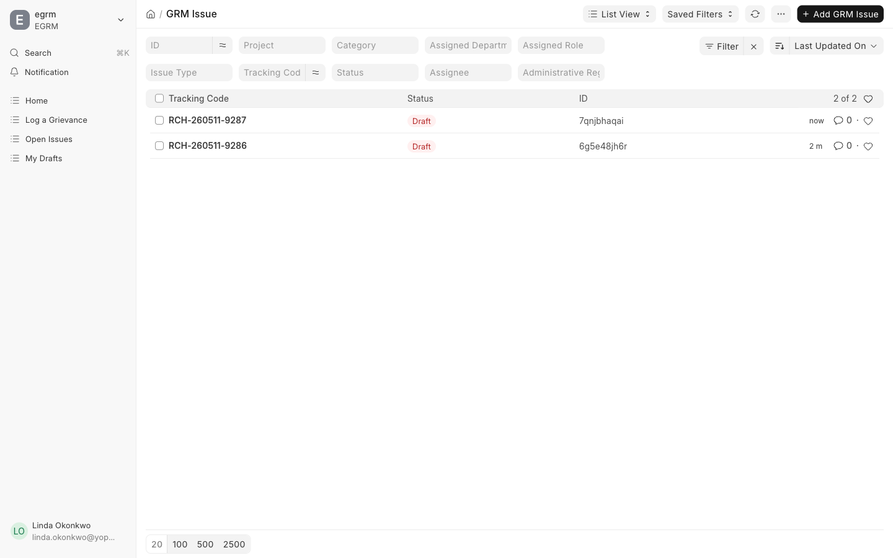

Most complaints do not arrive through the website. Someone stops you at a
meeting, calls the office, or sends an SMS. Your job is to get that into the
system accurately, so it reaches the right officer and the person can follow
it up.

## Record a complaint

<Callout type="info">
Away from a desk? The same complaint can be recorded on the
[mobile app](/docs/mobile/record), which works with no signal and syncs when
you get back into coverage.
</Callout>

From the sidebar, click **Andika Ikibazo** (*Record Issue*).

Fill in the form:

| Field (Kinyarwanda) | English | What to put |
| --- | --- | --- |
| Umushinga | Project | The project this belongs to |
| Icyiciro | Category | Complaint, Service Issue, Question or Other |
| Ubwoko bw'Ikibazo | Issue Type | **How it reached you** — In Person, Phone Call, SMS, Email, Verbal, Written |
| Itariki y'Ikibazo | Issue Date | When the problem happened |
| Itariki yo Kwakira | Intake Date | When it reached you |
| Ibisobanuro | Description | What happened, in as much detail as you have |
| Akarere | Region | Where the problem happened |

<Callout type="warn">
**Issue Type** records the channel the complaint arrived through, not how
serious it is. If someone telephoned you, choose **Phone Call** — not
**Web Form**, even though you are typing it into a web page. These figures are
used to decide which channels the public actually rely on.
</Callout>

Then save.

## Give the person their tracking code

Saving produces a tracking code like `RDAP-260907-6503`.

<Callout type="warn">
Read this code back to the person, and make sure they have written it down,
before they leave or you end the call. If they gave no contact details, this
code is the only way they can ever check their complaint again.
</Callout>

Tell them they can check it at **egrm.risa.gov.rw/grm-portal** under
**Track**, and that it will show the status but not their description.

## Ask before you write

The quality of a complaint depends almost entirely on what you capture at this
moment. Before you save, check you have:

- **Where exactly.** A village or facility name, not just a district. This is
  what decides who receives it.
- **When exactly.** A date, even an approximate one.
- **What specifically went wrong**, in the person's own words rather than a
  summary like "service problem".
- **Whether they want to be contacted.** If they do, take a phone number. If
  they would rather not be named, that is their right — record it anonymously
  and say so.

## Checking on what you have recorded

**Ibibazo Bifunguye** (*Open Issues*) in the sidebar lists complaints that are
still active.

The coloured pill in the **Imimerere** (*Status*) column shows where each one
has got to:

| Pill | English | Meaning |
| --- | --- | --- |
| Gishya | New | Recorded, not yet reviewed |
| Birakorwa | In Progress | Assigned, being worked on |
| Byakemuwe | Resolved | An outcome has been recorded |

You will only see complaints for the regions you are assigned to.

## If you get stuck

- **The region you need is not in the list.** Choose the nearest level above
  it and name the exact place in the description. Then tell your administrator
  the region is missing.
- **You saved it with the wrong details.** Open the complaint and use
  **Reassign Issue** for the wrong owner, or ask a reviewer for anything else
  — once submitted, some fields are locked to keep the record trustworthy.
- **Someone reports the same problem twice.** Record it anyway and mention the
  earlier tracking code in the description. A reviewer will merge them.
