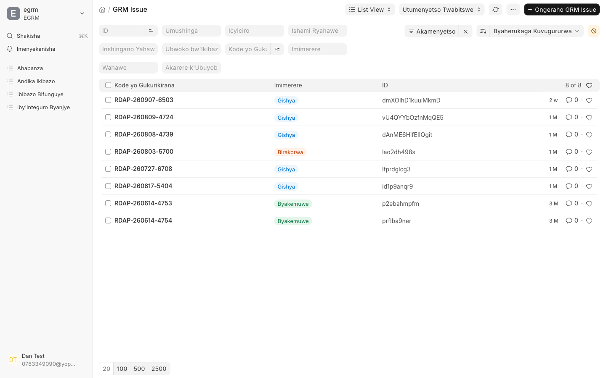
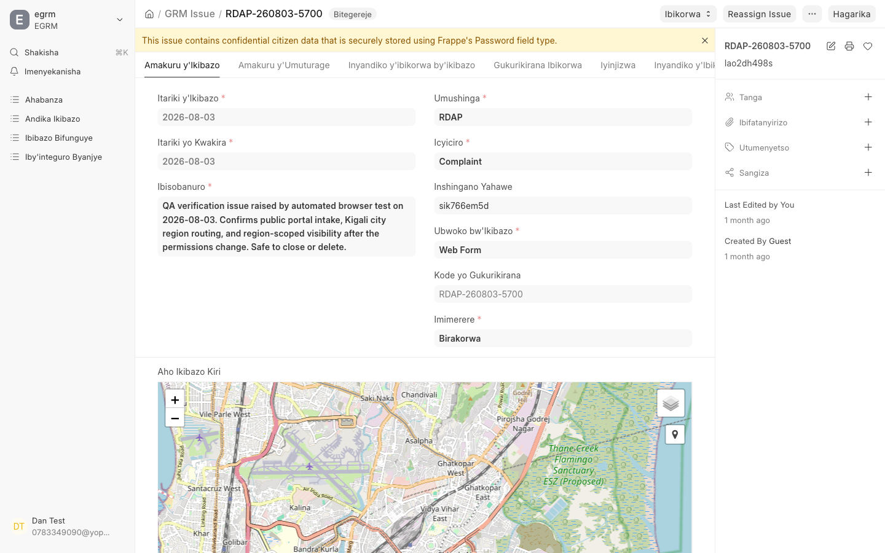
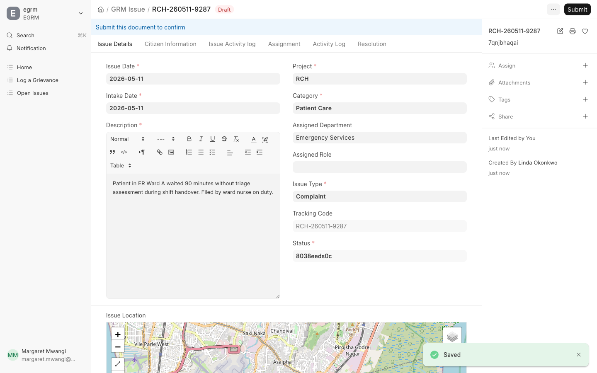
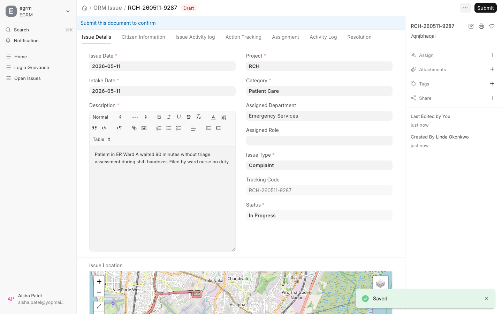

You are the point where a complaint stops being a piece of text and becomes
someone's assigned work. Two things depend on you: that it reaches the right
officer, and that what happened is written down.

## Find what needs your attention

Three places in the sidebar:

| Kinyarwanda | English | What is in it |
| --- | --- | --- |
| Ibibazo Bifunguye | Open Issues | Everything still active in your regions |
| Iby'integuro Byanjye | My Assignments | Complaints assigned to you personally |
| Andika Ikibazo | Record Issue | Enter a new complaint yourself |

The list shows the tracking code, the status pill, and the reference. The grey
boxes along the top filter it — by project, category, department, assignee,
issue type, status or region. Newly arrived complaints carry the
**Gishya** (*New*) pill.

## Open a complaint

Click any row.

The tabs across the top separate the record into sections:

| Kinyarwanda | English | Holds |
| --- | --- | --- |
| Amakuru y'Ikibazo | Issue Details | The complaint itself — dates, category, description, region, status |
| Amakuru y'Umuturage | Citizen Information | Contact details, if any were given |
| Inyandiko z'ibikorwa by'ikibazo | Issue Activity Log | Every action taken, in order |
| Gukurikirana Ibibazo | Issue Tracking | Progress against the complaint |
| Iyinjizwa | Escalation | Escalation history, if it was escalated |

<Callout type="warn">
**Citizen Information may be empty, and that is deliberate.** People are
allowed to report anonymously. An empty contact tab is not a data problem and
is not something to chase — it means nobody may be called about this
complaint, and the outcome has to be published through the tracking code
instead.
</Callout>

## Assign it to someone

Use **Assign** in the right-hand panel to add an officer, or **Reassign
Issue** at the top of the page to move it to a different one.

Before you assign, check two things:

1. **Is the region right?** Routing follows the region on the complaint. If it
   is wrong, the complaint sits with an office that cannot act on it.
2. **Is the category right?** A "Question" misfiled as a "Complaint" enters a
   resolution process it never needed.

Both are quicker to correct now than after the work has been handed on.

## Record the outcome

When the assigned officer has finished, the outcome is recorded against the
complaint and the status moves on.

<Callout type="info">
Recording the outcome moves the complaint to **Resolved** and stores your name
against it as the resolver. That status is the one the public sees on the
tracking page, so the person checking their code is told as soon as you save —
there is no separate step to publish it.
</Callout>

Write the outcome so that it makes sense to someone who was not involved: what
was found, what was done, and when. This text is the record of the decision.

## Escalations and appeals

Two cards on the main screen cover work that did not finish normally:

- **Igenzura → Ibyitwajwe** (*Supervision → Escalated*) — complaints raised to
  a higher level, usually because they passed their time limit or needed
  authority the assigned officer did not have.
- **Igitekerezo → Ubujurire** (*Feedback → Appeals*) — where someone has come
  back dissatisfied with the outcome.

Check both regularly. Neither will come to you as a notification if you are
not assigned to the individual complaint.

## What you can and cannot see

You see complaints for the regions you are assigned to, **including the
regions beneath them**. A supervisor assigned at province level sees the
districts within it; an officer assigned to one district sees only that one.

If a complaint you expect is missing, the usual cause is a region assignment,
not a permission setting — check with your administrator.

## If you get stuck

- **A complaint is in the wrong region.** Correct the region, then reassign.
  Changing the assignee alone leaves the routing wrong for next time.
- **Nobody is available in the assigned department.** Reassign to another
  officer rather than leaving it unassigned — an unassigned complaint has no
  owner and will not be picked up by anyone.
- **The same problem is reported twice.** Resolve one and record the other's
  tracking code in the outcome, so both codes give the person a real answer.
