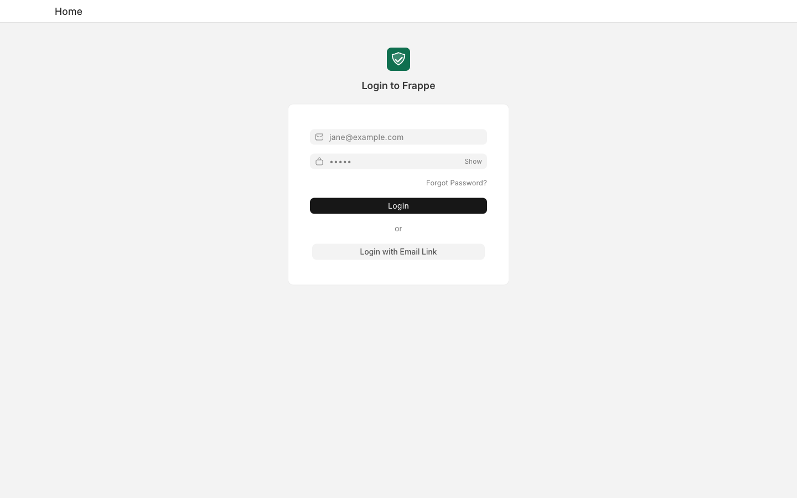
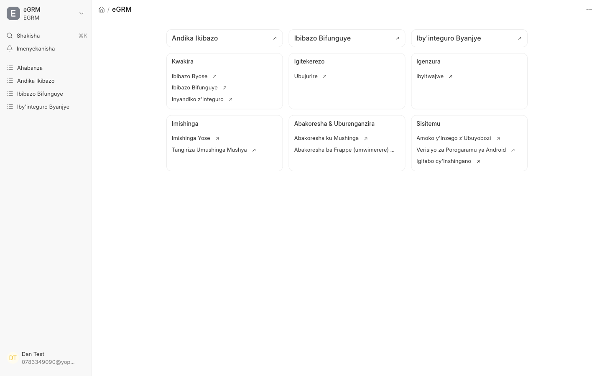

Staff work in a different part of the system from the public website. You need
an account, which an administrator creates for you.

## Sign in

Go to **[egrm.risa.gov.rw/login](https://egrm.risa.gov.rw/login)** and enter
the email address and password you were given.

After signing in you land on the **eGRM** work area.

## The main screen

Two parts matter:

**The sidebar on the left** is always there. Its entries are:

| Kinyarwanda | English |
| --- | --- |
| Shakisha | Search |
| Imenyekanisha | Notifications |
| Ahabanza | Home |
| Andika Ikibazo | Record Issue |
| Ibibazo Bifunguye | Open Issues |
| Iby'integuro Byanjye | My Assignments |

**The cards in the middle** group everything else by the kind of work it
belongs to — intake, feedback, supervision, projects, users, and system
settings. You will only be able to open the ones your role allows.

Your name and email are shown at the bottom-left. Click there to sign out.

<Callout type="info">
The staff screens display in **Kinyarwanda**, because that is the language
this system is set to. The [Screen labels](/docs/glossary) page lists every
label you will meet with its English meaning. If you would rather work in
English, ask your administrator to set the language on your own account — it
changes only what you see, not what anyone else sees.
</Callout>

## Which role am I?

Roles in eGRM are about **duties**, and most staff hold several at once. What
actually differs between two officers is usually the **region** they are
assigned to, not the buttons they can press.

| If your job is… | Read |
| --- | --- |
| Taking complaints from the public and entering them | [Field Officer](/docs/staff/field-officer) |
| Checking new complaints and sending them to the right person | [Reviewer and Supervisor](/docs/staff/reviewer) |
| Setting up projects, regions and staff accounts | [Project Administrator](/docs/staff/administrator) |

## If you get stuck

- **Your password does not work.** Passwords are not shown to anyone, so a
  reset is the only fix — ask your administrator.
- **You sign in but see almost nothing.** You have an account but no region
  assignment yet. Until an administrator assigns you to a region, there are no
  complaints you are allowed to see.
- **A complaint you expect is missing.** You only see complaints for the
  regions you are assigned to. If it belongs to a neighbouring district, it
  will not appear for you.
